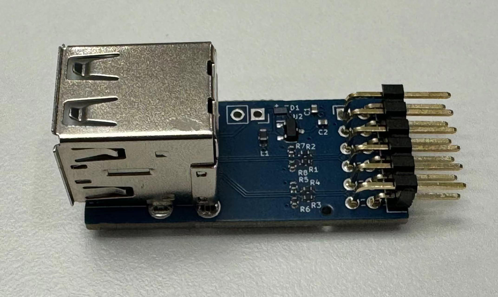

# USB Host PMOD

Design sources for a **dual-socket USB host PMOD** module, intended to interface USB devices on FPGA boards through [usb_hid_host](https://github.com/nand2mario/usb_hid_host). 

Included are [KiCAD sources](kicad/) and [production files](production/)(Gerber/BOM/PNP).

Easiest way to obtain the module is to follow the [guide to directly order from JLCPCB](doc/guide.md).

This little design is done by Yimin, [@ico_TC](https://twitter.com/ico_TC) and [nand2mario](https://twitter.com/nand2mario).