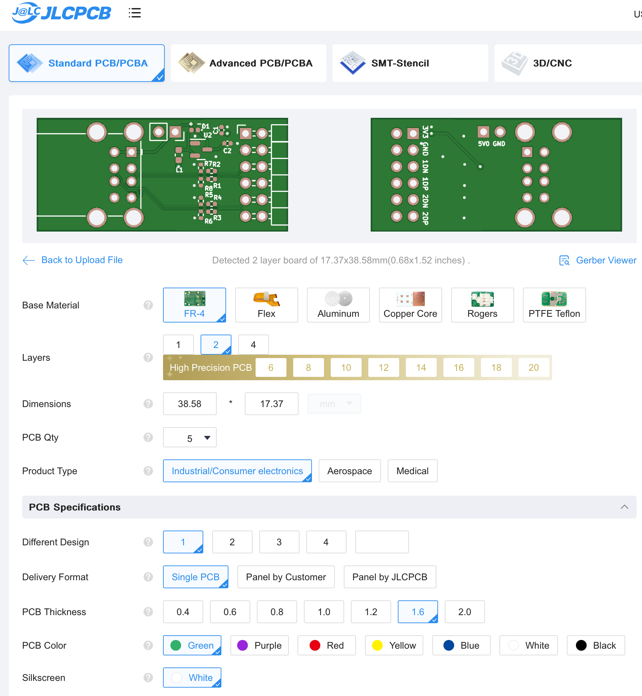
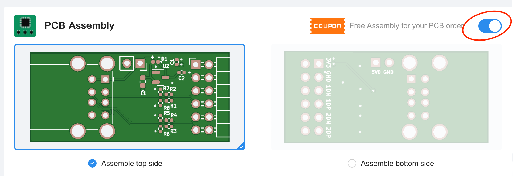
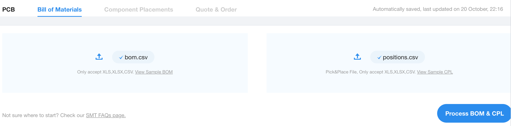
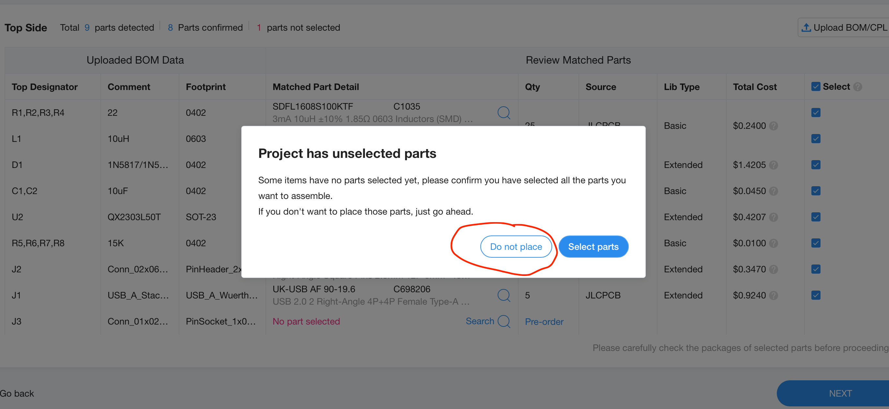
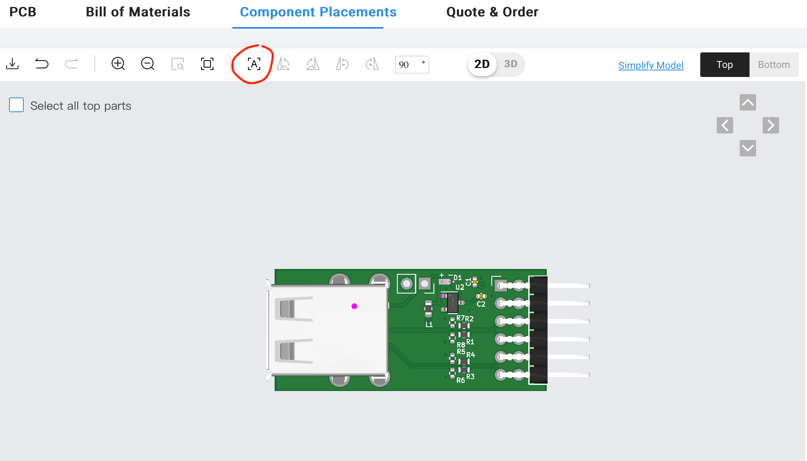

# JLCPCB Ordering Guide

This is the steps to have the PCB manufactured and components assembled by JLCPCB. 5 modules cost ~$28 plus shipping. 10 modules cost ~$34 plus shipping.

1. Clone or [download](https://github.com/nand2mario/usb_host_pmod/archive/master.zip) the USB Host PMOD repository.

2. Create an account with [JLCPCB.com](http://JLCPCB.com).

3. Go to: [https://cart.jlcpcb.com/quote](https://cart.jlcpcb.com/quote)

4. Click the `Add gerber file` button and select [usb_host_pmod.zip](../production/usb_host_pmod.zip).

5. You should now see the PCB front and back in the preview 

6. There are a few properties that you can customize if you want. The PCB quantity (the amount you want made), thickness, color, and surface finish are all I recommend adjusting to preference.

7. Select the toggle button to enable SMT Assembly 

8. Select the `Assemble top side` option

9. Select how many boards you want assembled with the `PCBa Qty` option

10. Select the `confirm` and then `Next` button to continue

11. Upload the [bom.csv](../production/bom.csv) and [positions.csv](../../positions.csv) files on the Bill of Materials page. Then click "Process BOM & CPL" to proceed.

12. Click "Next" again on the Bill of Materials page. Click "do not place" on the popup dialog, as we do not need the J3 pin placed.

13. You should now see a preview of the parts placement on the PCB. The placement of some components will appear wrongly placed. **This is ok.** Just press the "align" (marked with an "A") button on the toolbar and it will be fixed. 

14. Click "Next" again and you will see the price quote. Here you can place the order in the cart and on the next page, you can check out.

*This page is based on [Cheap-FOCer-2 ordering guide](https://github.com/shamansystems/Cheap-FOCer-2/blob/master/guides/ordering/readme.md)*
